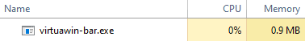

<h1 align="center">virtuawin-bar</h1>

_**virtuawin-bar**_ is a [VirtuaWin](https://virtuawin.sourceforge.io/) module
which lists all of the non-empty virtual desktops, and highlights the currently
active one.  It is aesthetically similar to status bars designed to work with
tiling window managers, like i3bar and Polybar.

For convenience, *virtuawin-bar* also optionally provides keybindings for
switching focus to a window in a specified cardinal direction, similar to
functionality found in tiling window managers.  This feature is disabled by
default in order to be non-intrusive.

*virtuawin-bar* is light on system resources, and uses less than 1 MB of memory
and negligible CPU time when idle.

This project is unaffiliated with the official VirtuaWin project.

Installing
----------

### Binary releases

TODO: Will be available from the [Releases
page](https://github.com/enjmiah/virtuawin-bar/releases).

Simply drop `virtuawin-bar.exe` into the `modules` directory of your VirtuaWin
installation to install it.  See the [official documentation on
modules][vwmodules] for details.

### Building from source

*virtuawin-bar* requires a C++14 compiler and CMake.  The third-party libraries
[inih](https://github.com/benhoyt/inih) and a subset of [Cairo][cairo] have been
included in this repository under `3rdparty` for convenience.

Create a build folder and run CMake from there:

    mkdir build && cd build
    cmake ..

Finally, to build the code:

    cmake --build . --config Release

This will produce `virtuawin-bar.exe`, a VirtuaWin module. Copy the executable
into the `modules` directory of your VirtuaWin installation to install it. By
default, the build is configured to statically-link to Cairo and inih; if you
switch to dynamic linking, you will also need to copy over the necessary DLLs.
See the [official documentation on modules][vwmodules] for details.

[cairo]: https://www.cairographics.org/
[vwmodules]: https://virtuawin.sourceforge.io/?page_id=50

Configuration
-------------

*virtuawin-bar* can be configured using a configuration file located at
`%APPDATA%/vwbar.ini`.  See [`vwbar.ini`](vwbar.ini) for documentation and an
example configuration file.

Limitations
-----------

*virtuawin-bar* only refreshes when you switch to a new desktop — to save
resources, it does *not* poll for changes.  VirtuaWin (currently) does not
support setting a handler in response to when you move a window to an empty
desktop, thus when doing so, the bar display will be out of date until the next
desktop switch.
